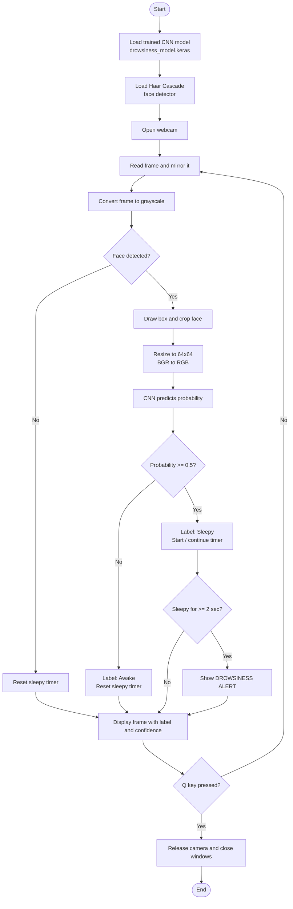
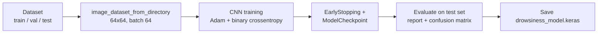

# DriveSense AI
 
**DriveSense AI** is an AI-powered driver-assistance project that aims to make driving safer by combining computer vision and machine learning in one system.
 
## Features
 
| # | Feature | Status |
|---|---------|--------|
| 1 | Drowsiness Detection | Completed |
| 2 | Road & Lane Detection | Partial |
| 3 | Vehicle Health Prediction | Planned |
| 4 | Accident Risk Alert | Planned |
 
---
 
## Feature 1: Drowsiness Detection
 
Detects in real time whether the driver is **awake** or **sleepy** using a webcam. If the driver stays sleepy for more than **2 seconds**, a **DROWSINESS ALERT** is shown on screen.
 
### Demo
 

 
*Live webcam feed: the face is detected (blue box) and classified as Awake/Sleepy with a confidence score.*
 
### How It Works (Flow Chart)
 

 
### Model Training Pipeline
 

 
### Model Architecture
 
| Layer | Details |
|-------|---------|
| Input | 64 × 64 × 3 image |
| Rescaling | Pixels normalized to 0–1 |
| Augmentation | RandomFlip (horizontal), RandomRotation (0.03) |
| Conv2D + MaxPooling | 16 filters, 3×3, ReLU |
| Conv2D + MaxPooling | 32 filters, 3×3, ReLU |
| Conv2D + MaxPooling | 64 filters, 3×3, ReLU |
| GlobalAveragePooling2D | Replaces Flatten to keep parameters low |
| Dense | 64 units, ReLU |
| Dropout | 0.4 |
| Output | Dense(1), Sigmoid (0 = Awake, 1 = Sleepy) |
 
**Training setup:** Adam optimizer, binary cross-entropy loss, up to 8 epochs, EarlyStopping (patience 2, restores best weights), and ModelCheckpoint saving the best model by validation accuracy.
 
### Results
 
> Add your numbers here after running the notebook.
 
| Metric | Value |
|--------|-------|
| Test Accuracy | _xx.x%_ |
| Test Loss | _x.xxx_ |
 
You can also add the confusion matrix image (`plt.savefig("assets/confusion_matrix.png")`) here.
 
---
 
## Tech Stack
 
- **Python 3.11**
- **TensorFlow / Keras** – CNN model
- **OpenCV** – webcam capture, Haar Cascade face detection
- **NumPy, Pandas** – data handling
- **Matplotlib, Seaborn, scikit-learn** – evaluation and visualization
## Project Structure
 
```
Drivesense_ai/
├── archive (1)/data/
│   ├── train/        # awake / sleepy images
│   ├── val/
│   └── test/
├── Drowsiness_Detection.ipynb   # training + real-time detection
├── drowsiness_model.keras       # saved trained model
├── assets/
│   └── drowsiness_demo.png
└── README.md
```
 
## How to Run
 
1. **Clone the repo**
```bash
   git clone https://github.com/JiyaBatra/DriveSense_Ai.git
   cd DriveSense_Ai
```
2. **Install dependencies**
```bash
   pip install tensorflow opencv-python==4.10.0.84 numpy pandas matplotlib seaborn scikit-learn pillow
```
3. **Train the model** (or use the provided `drowsiness_model.keras`): run the training cells in `Drowsiness_Detection.ipynb`.
4. **Start real-time detection:** run the webcam cells in the notebook. Press **Q** to quit.
## Configuration
 
| Parameter | Default | Meaning |
|-----------|---------|---------|
| `IMG_SIZE` | (64, 64) | Input size for the CNN |
| `ALERT_TIME` | 2.0 sec | Sleepy duration before the alert triggers |
| `scaleFactor` / `minNeighbors` | 1.1 / 5 | Haar face detection sensitivity |
 
## Future Work
 
- **Road & Lane Detection** – detect lane lines and road boundaries from the camera feed
- **Vehicle Health Prediction** – predict maintenance needs from vehicle data
- **Accident Risk Alert** – combine all modules into a single risk score
- Add an audio alarm to the drowsiness alert
- Use eye-aspect-ratio or eye-region detection for better accuracy
## Author
 
**Jiya Batra** – [GitHub](https://github.com/JiyaBatra/DriveSense_Ai)
 