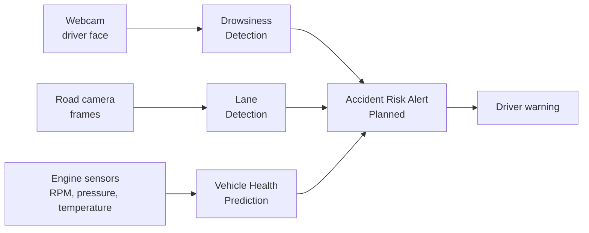
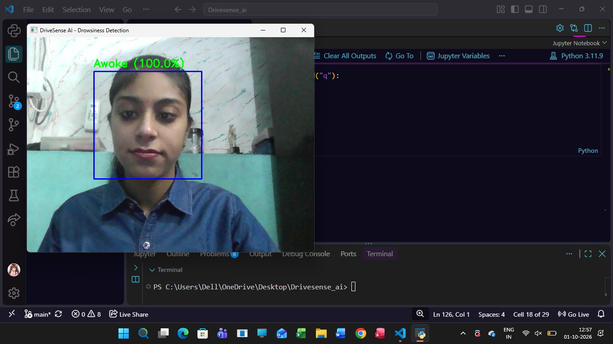
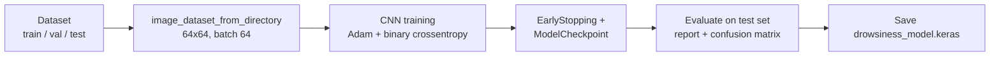
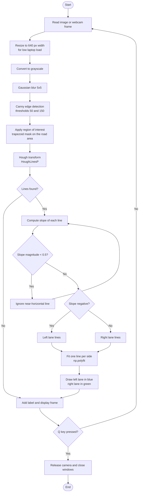
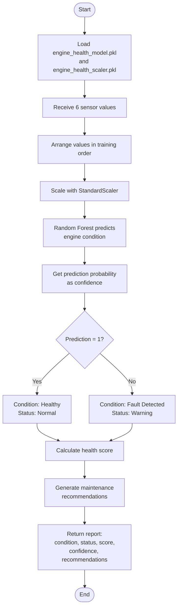
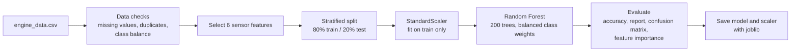
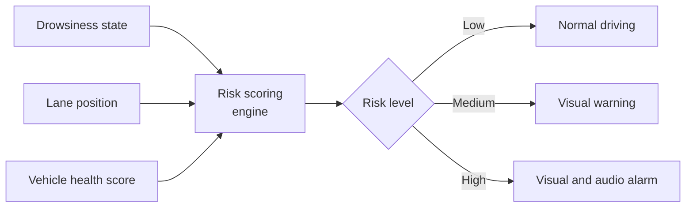

# DriveSense AI
 
**DriveSense AI** is an AI-powered driver-assistance project that aims to make driving safer by combining computer vision and machine learning in a single system. It monitors the driver, the road, and the vehicle itself.
 
## Features
 
| # | Feature | Technique | Status |
|---|---------|-----------|--------|
| 1 | Drowsiness Detection | CNN + Haar Cascade | Completed |
| 2 | Road & Lane Detection | Classical computer vision (Canny + Hough) | In Progress |
| 3 | Vehicle Health Prediction | Random Forest on engine sensor data | Completed |
| 4 | Accident Risk Alert | Combined risk score from all modules | Planned |
 
## System Overview
 

 
---
 
## Feature 1: Drowsiness Detection
 
Detects in real time whether the driver is **awake** or **sleepy** using a webcam. If the driver stays sleepy for more than **2 seconds**, a **DROWSINESS ALERT** is shown on screen.
 
### Demo
 

 
*Live webcam feed: the face is detected (blue box) and classified as Awake/Sleepy with a confidence score.*
 
### How It Works (Flow Chart)
 

 
### Model Training Pipeline
 

 
### Model Architecture
 
| Layer | Details |
|-------|---------|
| Input | 64 × 64 × 3 image |
| Rescaling | Pixels normalized to 0–1 |
| Augmentation | RandomFlip (horizontal), RandomRotation (0.03) |
| Conv2D + MaxPooling | 16 filters, 3×3, ReLU |
| Conv2D + MaxPooling | 32 filters, 3×3, ReLU |
| Conv2D + MaxPooling | 64 filters, 3×3, ReLU |
| GlobalAveragePooling2D | Replaces Flatten to keep parameters low |
| Dense | 64 units, ReLU |
| Dropout | 0.4 |
| Output | Dense(1), Sigmoid (0 = Awake, 1 = Sleepy) |
 
**Training setup:** Adam optimizer, binary cross-entropy loss, up to 8 epochs, EarlyStopping (patience 2, restores best weights), and ModelCheckpoint saving the best model by validation accuracy.
 
### Results
 
| Metric | Value |
|--------|-------|
| Test Accuracy | _xx.x%_ |
| Test Loss | _x.xxx_ |
 
---
 
## Feature 2: Road & Lane Detection (In Progress)
 
Detects the left and right lane boundaries on a road image or a live camera feed and overlays them on the frame. The current version uses classical computer vision (no training required), which keeps it light enough to run on a laptop without a GPU.
 
**Current status**
 
- Lane detection on single images: working
- Live webcam lane detection: working
- Planned: use the road-line annotations to measure accuracy, and add lane-departure warnings
### How It Works (Flow Chart)
 

 
### Pipeline Parameters
 
| Parameter | Value | Purpose |
|-----------|-------|---------|
| Resize width | 640 px | Reduce compute load |
| Gaussian kernel | 5 × 5 | Remove noise before edge detection |
| Canny thresholds | 50 / 150 | Edge sensitivity |
| Region of interest | Trapezoid (bottom of frame up to 55% height) | Focus on the road ahead |
| Hough threshold / min length / max gap | 40 / 40 / 100 | Line detection sensitivity |
| Slope filter | abs(slope) ≥ 0.5 | Discard horizontal edges |
 
---
 
## Feature 3: Vehicle Health Prediction
 
Predicts whether an engine is **healthy** or has a **fault** from six sensor readings, then produces a readable report: condition, status, health score, model confidence, and maintenance recommendations.
 
### Demo
 

 
*Demo recording of the vehicle health prediction running on sample sensor inputs.*
 
### Input Sensors
 
| Sensor | Description |
|--------|-------------|
| Engine rpm | Engine speed |
| Lub oil pressure | Lubrication oil pressure |
| Fuel pressure | Fuel line pressure |
| Coolant pressure | Cooling system pressure |
| lub oil temp | Lubrication oil temperature |
| Coolant temp | Coolant temperature |
 
### How It Works (Flow Chart)
 

 
### Model Training Pipeline
 

 
### Health Score Logic
 
The health score starts at **100** and rule-based penalties are applied for out-of-range readings. An additional penalty is applied when the model detects a fault. The score is kept between 0 and 100.
 
| Condition | Penalty |
|-----------|---------|
| Engine RPM above 3500 / above 4000 | −5 / −10 |
| Oil pressure below 2.5 / below 2 | −10 / −20 |
| Coolant temperature above 100 / above 105 | −10 / −20 |
| Oil temperature above 100 / above 110 | −8 / −15 |
| Coolant pressure below 1.5 | −10 |
| Model predicts a fault | −15 |
 
### Example Output
 
```python
predict_vehicle_health(
    engine_rpm=750,
    oil_pressure=3.2,
    fuel_pressure=6.5,
    coolant_pressure=2.4,
    oil_temperature=80,
    coolant_temperature=78
)
# {
#   "condition": "Healthy",
#   "status": "Normal",
#   "health_score": 100,
#   "confidence": <model confidence in %>,
#   "recommendation": ["Engine parameters are within the expected range. Continue regular monitoring."]
# }
```
 
### Results
 
> Add your numbers here after running the notebook.
 
| Metric | Value |
|--------|-------|
| Test Accuracy | _xx.x%_ |
| Weighted F1-score | _x.xx_ |
 
---
 
## Feature 4: Accident Risk Alert (Planned)
 
Combine the outputs of all modules into a single risk score and warn the driver in real time.
 

 
---
 
## Tech Stack
 
- **Python 3.11**
- **TensorFlow / Keras**: CNN model for drowsiness detection
- **OpenCV**: webcam capture, Haar Cascade face detection, lane detection (Canny, Hough transform)
- **scikit-learn**: Random Forest, preprocessing, evaluation
- **joblib**: saving and loading the vehicle health model and scaler
- **NumPy, Pandas**: data handling
- **Matplotlib, Seaborn**: evaluation and visualization
## Project Structure
 
```
Drivesense_ai/
├── archive (1)/data/             # drowsiness dataset
│   ├── train/                    # awake / sleepy images
│   ├── val/
│   └── test/
├── archive/                      # road lane dataset
│   ├── road_line_images/
│   └── road_line_annotation/
├── archive (2)/engine_data.csv   # engine sensor dataset
├── Drowsiness_Detection.ipynb    # training + real-time detection
├── Lane_Detection.ipynb          # lane detection (in progress)
├── Vehicle_Health.ipynb          # vehicle health prediction
├── drowsiness_model.keras        # saved drowsiness model
├── engine_health_model.pkl       # saved vehicle health model
├── engine_health_scaler.pkl      # saved feature scaler
├── assets/
│   ├── drowsiness_demo.png
│   └── vehicle_health.mp4
└── README.md
```
 
## How to Run
 
1. **Clone the repo**
```bash
git clone https://github.com/JiyaBatra/DriveSense_Ai.git
cd DriveSense_Ai
```
2. **Install dependencies**
```bash
pip install tensorflow opencv-python==4.10.0.84 numpy pandas matplotlib seaborn scikit-learn pillow joblib
```
3. **Drowsiness detection:** train the model (or use the provided `drowsiness_model.keras`) in `Drowsiness_Detection.ipynb`, then run the webcam cells. Press **Q** to quit.
4. **Lane detection:** run `Lane_Detection.ipynb` to test on a sample image, or run the webcam cell for live detection. Press **Q** to quit.
5. **Vehicle health prediction:** run `Vehicle_Health.ipynb` to train and save the model, then call `predict_vehicle_health(...)` with the six sensor values.
## Configuration
 
| Parameter | Default | Meaning |
|-----------|---------|---------|
| `IMG_SIZE` | (64, 64) | Input size for the drowsiness CNN |
| `ALERT_TIME` | 2.0 sec | Sleepy duration before the alert triggers |
| `scaleFactor` / `minNeighbors` | 1.1 / 5 | Haar face detection sensitivity |
| `n_estimators` | 200 | Number of trees in the vehicle health Random Forest |
| `test_size` | 0.20 | Train/test split for vehicle health |
 
## Future Work
 
- **Road & Lane Detection**: finish evaluation against the annotations and add lane-departure warnings
- **Accident Risk Alert**: combine all modules into a single risk score
- Add an audio alarm to the drowsiness alert
- Use eye-aspect-ratio or eye-region detection for better drowsiness accuracy
- Add vibration sensing to the vehicle health module for richer fault detection
## Author
 
**Jiya Batra** – [GitHub](https://github.com/JiyaBatra)
 
